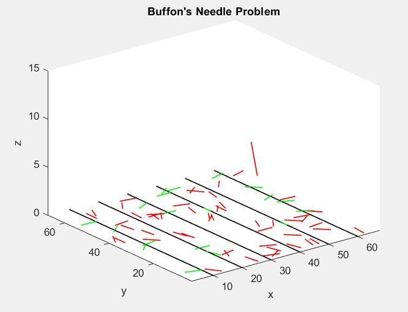
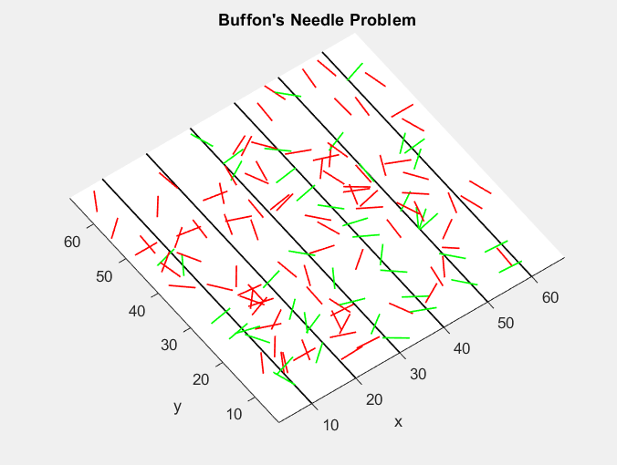

# Buffon's Needle Problem

* The simulation of the **Buffon’s Needle Problem** is about dropping
needles on a lined surface and determining the probability of the needles
crossing one of the lines.

* It's a great method for approximating the number `π`.

## How to call the function?

`needle(d, l, n, nr_needles, nr_lines);`
* `d` - distance between lines
* `l` - the length of the needles
* `n` - the number of dropped needles
* `nr_needles` - the number of dropped needles visually displayed on the screen
* `nr_lines` - the number of lines

## Example:
* `needle(10, 5, 10000000000, 100, 2) => 3.141583382937757`

